# Vamos criar nosso primeiro projeto web com versionamento!

## Primeiro Passo

### Criar Repositório Remoto
O repositório remoto é local onde a cópia oficial de nossos projetos deverão permanecer para fins de controle, distribuição e trabalho colaborativo entre os desenvolvedores. O repositório remoto armazena todas as versões de nosso projeto. Nos próximos passos você criará um simples porém funcional `repositório remoto`.
1. Faça login na sua conta do GitHub.
2. Crie um novo projeto.
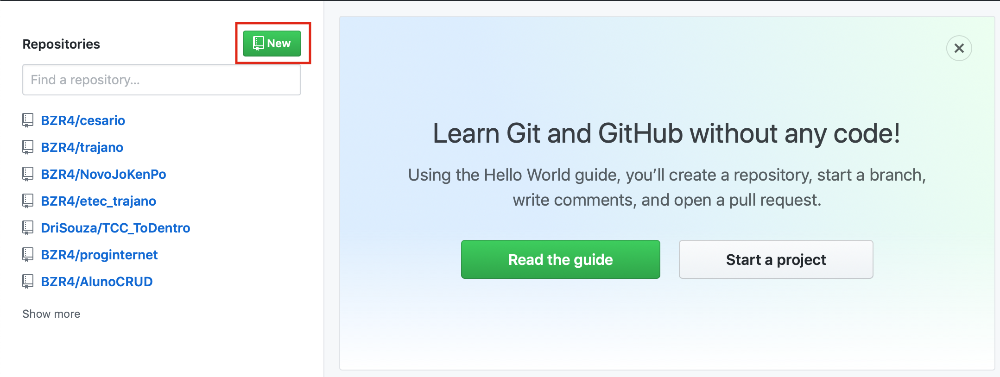
3. Informe o nome do seu projeto; não selecione a opção de inicializar o README e a opção do `.gitignore` conforme a imagem abaixo.
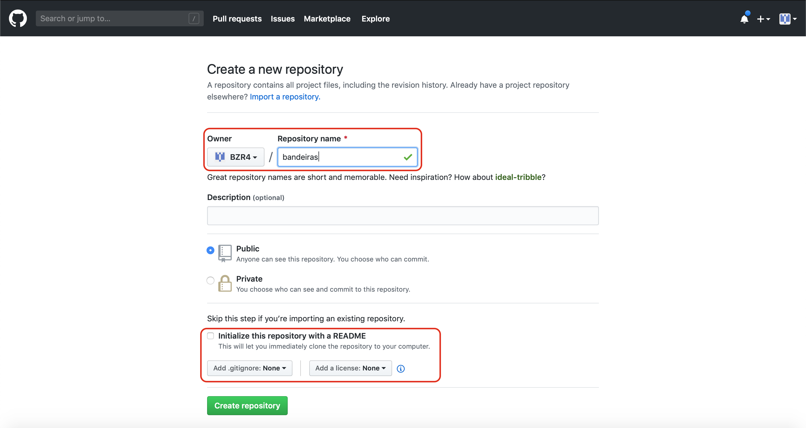
4. Clique no botão `Create repository`.
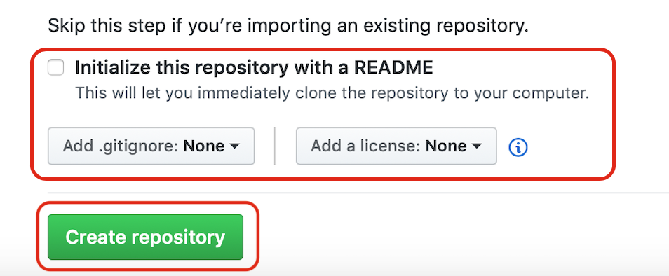
5. Na próxima tela você terá as informações do seu `repositório remoto`, assim como o fluxo inicial de instruções para realizar o sincronismo com o seu `repositório local`, e por falar em repositório local, vamos criá-lo no próximo passo.

## Segundo Passo
### Criar o Repositório Local
O repositório local é onde mantemos uma cópia de nosso repositório remoto e controlamos as alterações assim como as versões de nosso projeto em seu ciclo de vida. É nos `repositórios locais` que a codificação acontece e sempre que novas funcionalidades são desenvolvidas, nós devemos sincronizá-las com nosso `repositório remoto` para que o software fique atualizado e que os membros do time de desenvolvimento possam obter cópias atualizadas do projeto. É aqui que o trabalho realmente ocorre. Sem delongas, vamos criar o `repositório local`.
1. Crie um diretório na Área de Trabalho de seu computador e o identifique como `bandeiras`.
2. Com o `Visual Studio Code` no menu **File/Open Folder**, abra o diretório criado no passo anterior.
3. Teremos este cenário.
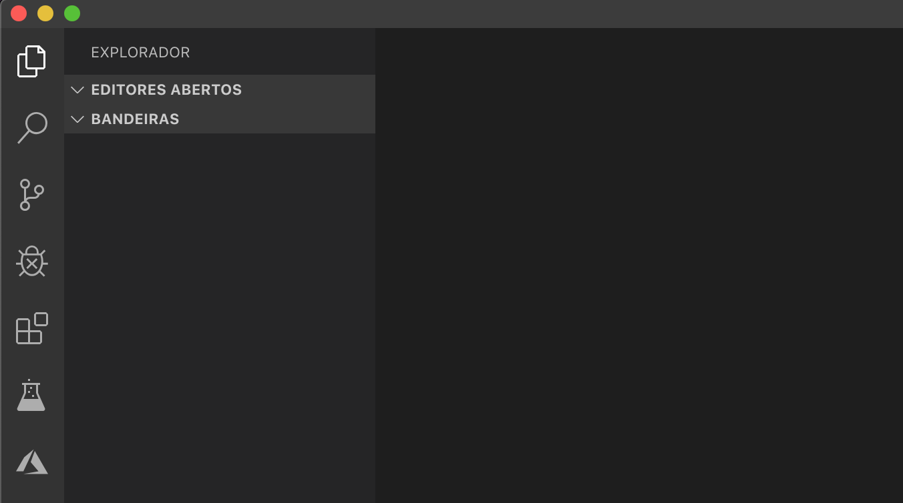
4. Adicione um novo arquivo; ao levar o cursor sobre o diretório, os ícones de ação surgirão, adicione um novo arquivo conforme a imagem abaixo.
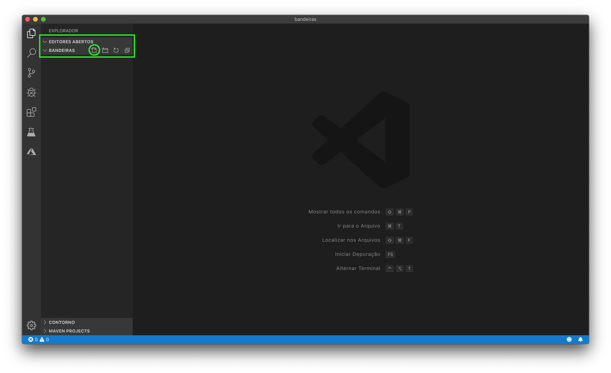
5. Vamos chamá-lo de `alemanha.html`.
6. Inclua o código abaixo no arquivo `alemanha.html`:
```html
<!DOCTYPE html>
<html lang="pt-br">
<head>
    <meta charset="UTF-8">
    <meta name="viewport" content="width=device-width, initial-scale=1.0">
    <meta http-equiv="X-UA-Compatible" content="ie=edge">
    <title>Alemanha</title>
    <style>
        *{
            margin: 0 auto;
        }

        body{
            height: 500px;
        }
        .preto{
            background-color: black;
            height: 33.33%;
        }

        .vermelho{
            background-color: red;
            height: 33.33%;
        }

        .amarelo{
            background-color: yellow;
            height: 33.33%;
        }
    </style>
</head>
<body>
    <section class="preto"></section>
    <section class="vermelho"></section>
    <section class="amarelo"></section>
</body>
</html>
```
7. Salve o arquivo.

Agora podemos dizer que temos a primeira versão do nosso projeto `bandeiras`; sendo assim agora vamos de fato criar nosso repositório.

8. Abra um novo terminal para podermos utilizar os comandos do `GIT`, conforme a imagem abaixo, no menu `Terminal`.
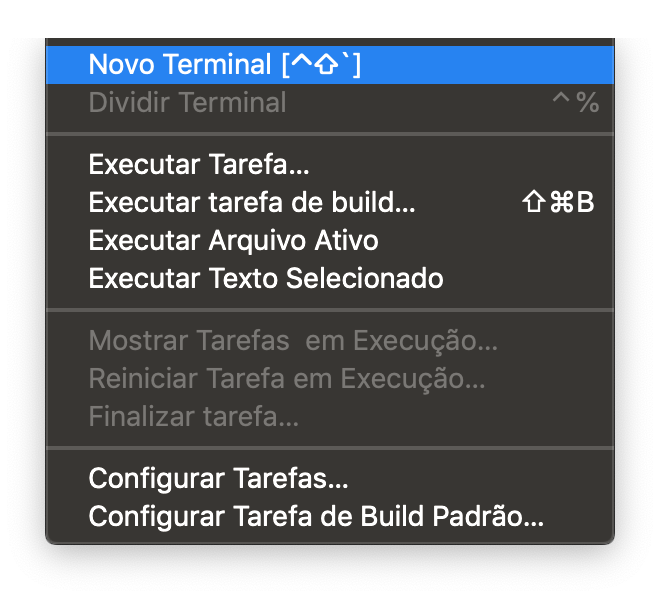
9. Vamos inicializar o versionamento pelo `GIT` através do comando `git init` em nosso terminal.
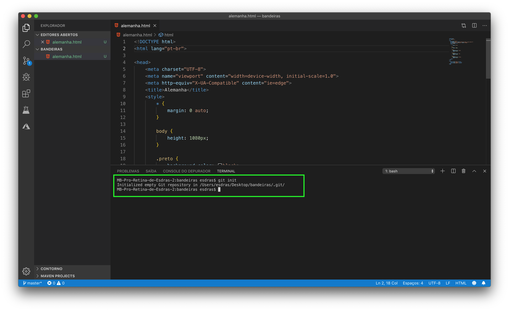
10. Agora nosso projeto já possui controle de versão! =)
11. Digite o comando `git status` para verificar a situação de seus arquivos.
12. Podemos verificar que embora tenhamos versionamento, o arquivo alemanha.html ainda não está `rastreado`, ou seja, ainda não fará parte de uma versão.
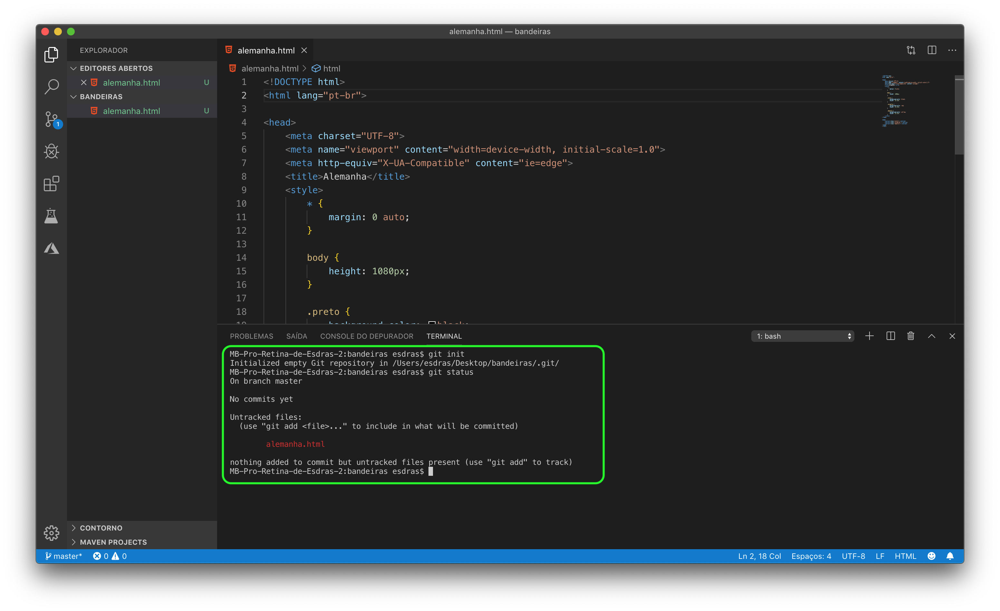
13. Para fazer com ele seja `rastreado`, precisamos adicioná-lo `stage` com o comando `git add alemanha.html`, logo em seguida execute o comando `git status` para validar a ação.
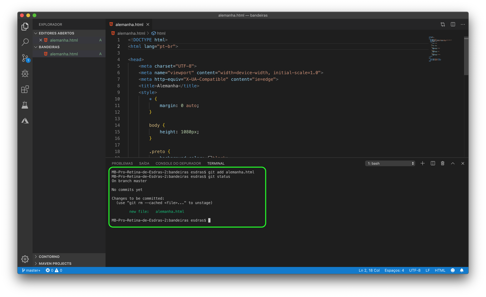
14. Agora que o arquivo `alemanha.html` está adicionado ao `stage`, poder criar nossa primeira versão. Execute o comando `git commit -m "Primeiro Commit - Bandeira da Alemanha"` e logo em seguida o comando `git status`.
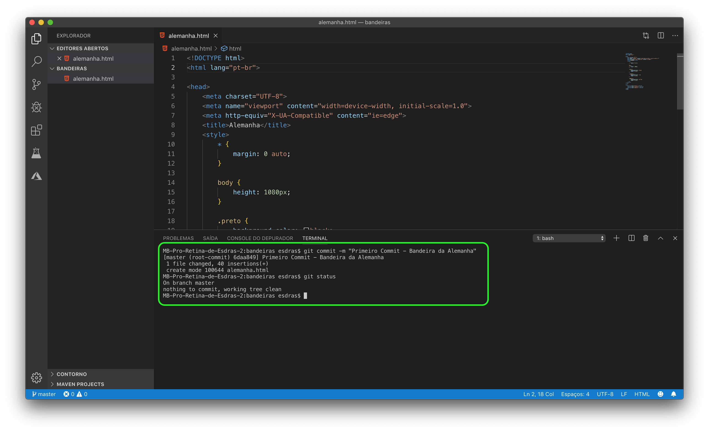
15. Nossa primeira verão foi criada, execute o comando `git log` para validar conforme a imagem abaixo.
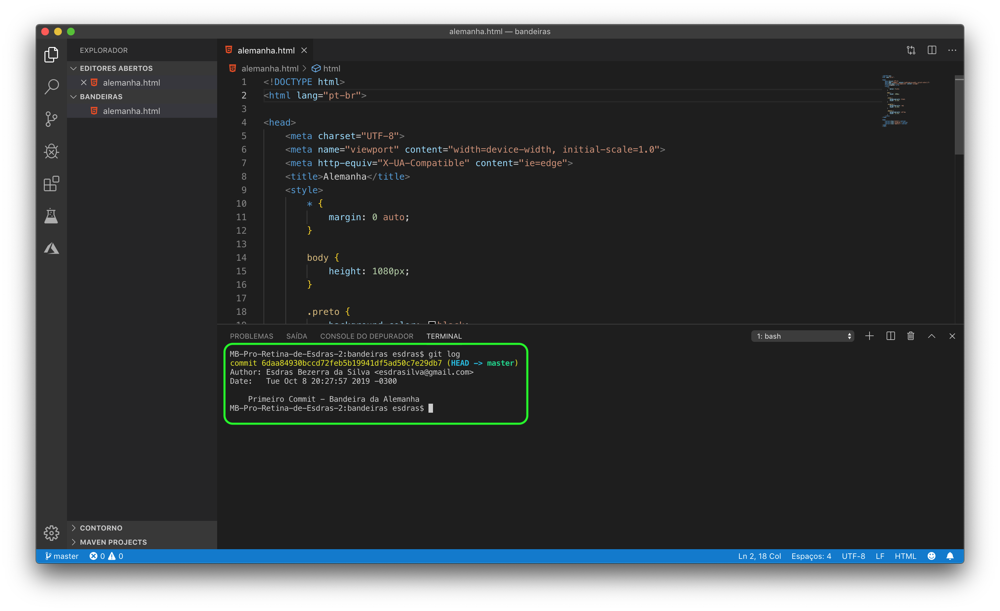

## Terceiro Passo
### Sincronizar os Repositórios
Agora iremos configurar o repositório remoto em nosso repositório local para podermos sincronizá-los.

1. Vá até o `GitHub`, na página de seu projeto e execute os seguintes comandos no Terminal:
```shell
git remote add origin https://github.com/SEU_USUARIO/bandeiras.git
```  
2. Agora seu projeto está configurado com seu repositório remoto! =)
3. Agora vamos enviar os dados do `repositório local` para o `repositório remoto`. Execute o comando abaixo:
```shell
git push -u origin master
```
# Sucesso!
Vá ao `GitHub` e verifique seus arquivos na nuvem, prontos para serem evoluídos!

# Tarefa
Crie algumas bandeiras para praticar o uso do `Git/GitHub`, para tal crie os arquivos abaixo:

1. Crie o arquivo `index.html`;
2. Crie a pasta `css`;
3. Crie o arquivo `estilo.css`, dentro da pasta `css`;
4. Mova o código CSS do arquivo `alemanha.html` para o arquivo `estilo.css`;
5. Associe o CSS nas páginas [`index.html`, `alemanha.html`] com a tag `link`;
6. Crie uma nova bandeira de sua preferência e associe ao arquivo `estilo.css`; mas você pode criar quantas bandeidas quiser;
7. Crie um link no `index` para acessar as 2 bandeiras;
8. Crie uma nova versão de seu site com um novo **COMMIT** e um novo **PUSH** com os comandos abaixo:
```shell
git status
git diff
git log
git add .
git commit -m "Segunda Versão - Bandeira [PAÍS]"
git push
```
Se você já fez esta atividade com as bandeiras na aula de `Programação para Web I`, voce pode adicionar novos **COMMITS** ao projeto também com as bandiras já criadas na disciplina.

Boa sorte!
